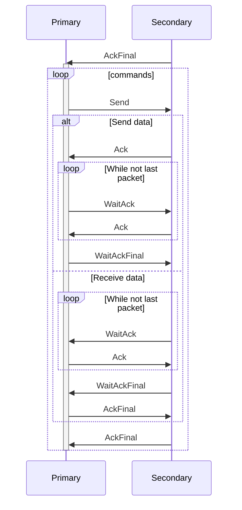

# IRCU
Handles lost frames, segmentation and receival acknowledgement. Sits on top of the [irc layer](irc.md). In Wii Fit U,
it is implemented in `libircu`, which seems to be statically linked into the application.

The devices can either be a primary (in the code: master) device or a secondary (in the code: slave) device.

## Connection flow

There are 5 type of packets that can be sent: 

1. [`WaitAck (0xF0)`](#waitack)
2. [`WaitAckFinal (0xF1)`](#waitackfinal)
3. [`Ack (0xF2)`](#ack)
4. [`AckFinal (0xF3)`](#ackfinal)
5. [`Send (0xF4)`](#send)
6. [`Retransmit (0xF5)`](#retransmit)

Peers take turns in sending packets. The device which sent [IRC `CreateConnection`](irc.md#createconnection) takes on the 
role as the primary device, the other device is the secondary device.

After sending every command, the primary device closes the connection by sending [IRC `CloseConnection`](irc.md#closeconnection).

At any point in the conversation, any peer may request a retransmission of the last packet sent by the other peer,
by sending the `Retransmit` packet. The other peer must send an exact copy of the last packet it sent.

## Packet structure

### WaitAck

Sender sends payload and waits for `Ack` receiver                   

| Name         | Offset (bytes) | Length (bytes)  | Value description      |
|--------------|----------------|-----------------|------------------------|
| Type         | 0x0            | 0x1             | `0xF0`                 |
| Payload      | 0x1            | *remaing bytes* | Payload                |

### WaitAckFinal

Sender sends the last part of payload and waits for `FinalAck` receiver

| Name         | Offset (bytes) | Length (bytes)  | Value description      |
|--------------|----------------|-----------------|------------------------|
| Type         | 0x0            | 0x1             | `0xF1`                 |
| Payload      | 0x1            | *remaing bytes* | Payload                |

### Ack

Sender acknowledges `WaitAck`, expects more data in `WaitAck` or `WaitAckFinal`

| Name         | Offset (bytes) | Length (bytes)  | Value description      |
|--------------|----------------|-----------------|------------------------|
| Type         | 0x0            | 0x1             | `0xF2`                 |

### AckFinal

The sender acknowledges a `WaitAckFinal` or `AckFinal`. Also sent by the
secondary device to await a new `Send` from the peer.

| Name         | Offset (bytes) | Length (bytes)  | Value description      |
|--------------|----------------|-----------------|------------------------|
| Type         | 0x0            | 0x1             | `0xF3`                 |

### Send

The sender initiates a new data request or data transmission. Only sent by the primary device.

| Name         | Offset (bytes) | Length (bytes)  | Value description      |
|--------------|----------------|-----------------|------------------------|
| Type         | 0x0            | 0x1             | `0xF4`                 |
| Command      | 0x1            | 0x1             | Command.               |
| Payload      | 0x2            | 0x2             | Argument (big-endian)? |

The first bit of `Command` is 0 for a data request, 1 for a data transmission. The remaining bits are the command code. 
These are up to the application to define. [See samu.md for the commands defined by Wii Fit U](samu.md).

### Retransmit

The sender requests a retransmission of the last packet sent by the peer.

| Name         | Offset (bytes) | Length (bytes)  | Value description  |
|--------------|----------------|-----------------|--------------------|
| Type         | 0x0            | 0x1             | `0xF5`             |
